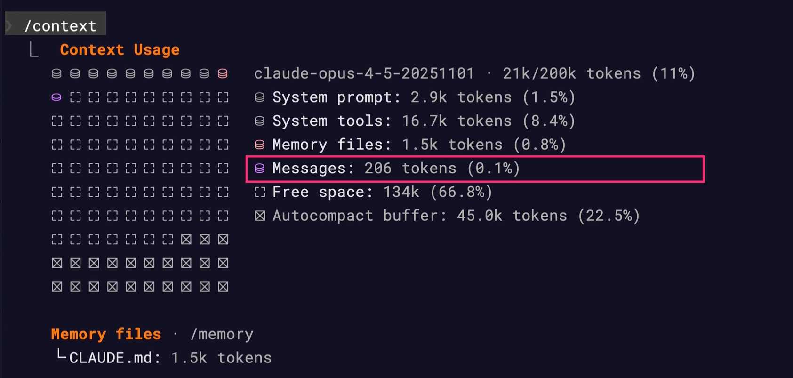
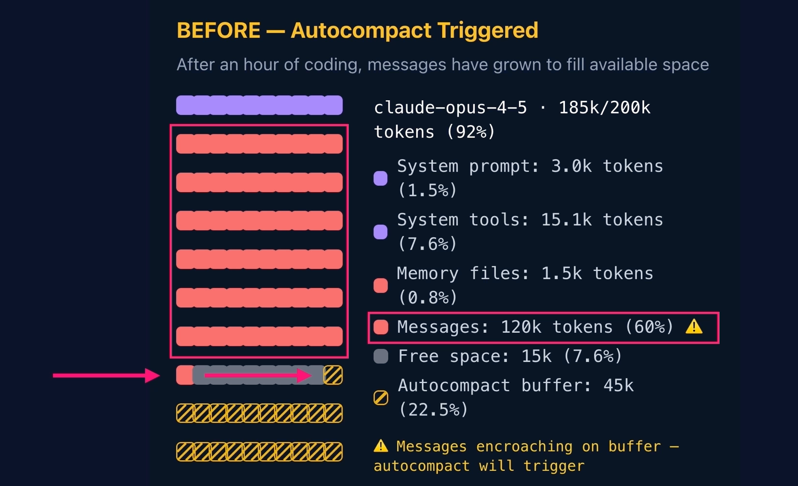

# /init et le fichier CLAUDE.md dans Claude Code

## Sujet du cours
Utilisation de la commande **/init** et du fichier **CLAUDE.md** pour donner à Claude Code une compréhension persistante d’un projet, de son architecture et des conventions de travail de l’équipe.

---

## Concepts clés
- **/init** : commande permettant d’analyser automatiquement un projet et de générer un fichier **CLAUDE.md**.
- **CLAUDE.md** : fichier Markdown contenant le contexte du projet (architecture, stack, conventions, workflows).
- **Fenêtre de contexte (context window)** :
    - mémoire de travail du modèle pendant une conversation.
    - capacité limitée (environ **100 000 à 200 000 tokens**, soit **300 à 600 pages de texte**).
- **Chargement prioritaire du contexte** :
    - le contenu du fichier **CLAUDE.md** est chargé au début de chaque conversation.

---

## Explications essentielles
Lors de l’utilisation de Claude Code, il peut être nécessaire de répéter régulièrement certaines instructions, par exemple :

- créer une branche Git pour chaque tâche
- écrire des tests
- respecter certaines conventions de développement.

La commande **/init** résout ce problème en permettant à Claude de **comprendre automatiquement le projet**.

Lorsque la commande est exécutée, Claude :

1. analyse la structure du projet
2. lit les fichiers importants (requirements, configuration, package.json, etc.)
3. identifie la stack technologique
4. génère un fichier **CLAUDE.md** dans la racine du projet.

Ce fichier contient généralement :

- une vue d’ensemble du projet
- la stack technologique
- les commandes courantes
- l’architecture
- les endpoints API
- les modèles de données.

---

## Méthodes / Raisonnements

### Fonctionnement de la mémoire de Claude
Claude fonctionne avec une **fenêtre de contexte limitée** qui contient :

- la conversation
- les fichiers ouverts
- les réponses générées.

Sans fichier **CLAUDE.md** :
- Claude commence chaque conversation **sans connaissance du projet**
- il faut réexpliquer la structure et les conventions
- ces informations peuvent être oubliées lorsque la conversation devient longue.

Avec **CLAUDE.md** :
- le contexte du projet est **chargé en premier dans la mémoire**
- Claude garde toujours accès aux informations importantes
- le comportement devient **plus cohérent et plus fiable**.

### Workflow recommandé
1. Exécuter **/init** pour générer un fichier de base.
2. Ouvrir **CLAUDE.md** et ajouter du contexte spécifique au projet :
    - conventions de code
    - workflows Git
    - choix d’architecture
    - règles de développement.
3. **Versionner le fichier dans Git** pour que toute l’équipe utilise les mêmes instructions.

---

## Exemples importants

### Configuration d’un workflow Git
Dans le fichier **CLAUDE.md**, il est possible de définir des règles comme :

- créer une **branche pour chaque tâche**
- utiliser une **convention de nommage des branches**
- faire des **commits atomiques**
- créer une **Pull Request lorsque la tâche est terminée**
- cocher la tâche correspondante dans **TASKS.md**.

```text
## Git Workflow
When working on tasks listed in Tasks.md:
1. Before starting, create a new branch named <type>/<task-number>-<brief-description>, where the branch type reflects the nature of the change (feat, fix, docs, test, or refactor).
2. Use atomic commits with conventional commit messages:
    - feat: for new features
    - fix: for bug fixes
    - docs: for documentation updates
    - test: for tests
    - refactor: for refactoring

3. Once the task is finished, open a pull request that includes:
    - A title matching the task description
    - A brief summary of the changes made
    - Any relevant testing notes or considerations
    - An updated checkbox in TASKS.md to mark the task as complete.
```

Une fois ces règles ajoutées :

- Claude applique automatiquement ce workflow
- il crée les branches
- pousse les modifications
- génère une Pull Request prête pour revue.

Tout cela **sans devoir le redemander à chaque prompt**.
```text
Complete task 1.2 <task> from Tasks.md
```

---

## Points à retenir
- **/init** analyse un projet et génère un fichier **CLAUDE.md**.
- **CLAUDE.md** contient le contexte permanent du projet.
- Ce fichier est **chargé au début de chaque conversation**, garantissant que Claude comprend toujours le projet.
- Il peut être **modifié manuellement** pour ajouter des conventions et workflows spécifiques.
- Versionner ce fichier permet à **toute l’équipe d’obtenir un comportement cohérent de Claude Code**.

# Résumé du cours — Test-Driven Iteration avec Claude Code

## Sujet du cours
Utilisation de l’approche **Test-Driven Iteration** avec Claude Code afin de produire du code fiable. Cette méthode repose sur une boucle automatisée où Claude écrit du code, génère des tests, les exécute et corrige le code jusqu’à ce que tous les tests réussissent.

---

## Concepts clés
- **Test-Driven Iteration** : cycle de développement basé sur les tests.
- **Boucle principale** :  
  *écrire le code → écrire les tests → exécuter les tests → corriger les erreurs → répéter*.
- **Configuration dans `CLAUDE.md`** : permet d’automatiser ce processus.
- **Règle fondamentale** : corriger le **code**, pas les tests, sauf si les tests sont réellement incorrects.

---

## Explications essentielles
Le principe consiste à intégrer une exigence de test dans le workflow de développement utilisé par Claude Code.  
Grâce à une section dédiée dans **CLAUDE.md**, Claude sait qu’il doit :

- écrire ou compléter le code demandé
- créer des **tests unitaires et/ou d’intégration**
- exécuter les tests
- corriger le code si un test échoue
- répéter jusqu’à ce que tous les tests passent.

Cette approche garantit que le code produit n’est pas seulement plausible, mais **fonctionnel et vérifié**.

Un point crucial est de **ne pas affaiblir les tests** pour les faire passer.  
Les tests doivent rester stricts afin de détecter les erreurs réelles.

---

## Méthodes / Raisonnements

### Boucle de développement automatisée
Processus suivi par Claude :

1. Implémenter la fonctionnalité demandée.
2. Écrire les tests correspondants.
3. Exécuter la suite de tests.
4. Si un test échoue :
    - analyser l’erreur
    - corriger le code.
5. Répéter jusqu’à ce que tous les tests réussissent.
6. Finaliser la tâche avec commit et Pull Request.

### Intégration dans le workflow
La configuration dans **CLAUDE.md** permet de demander simplement :

```text
## Testing Requirements
Before marking any task as complete:
1. Write unit tests for new fonctionality
2. Run the full test suite with
3. If Tets fail:
    - Analyse the failure output
    - Fix the code (no the test, unless tests are incorrect)
    - Re-Run tests until all pass
```

Claude exécute alors automatiquement toute la boucle de test et de correction.

---

## Exemples importants
Exemple : implémentation de l’endpoint

>  Implement the POST /api/auth/register endpoint from task 1.3 Make sure all test pass befor marking it complete.
 

Lors de cette tâche, Claude :

- crée des **fonctions utilitaires**
- ajoute de la **validation**
- implémente la **route d’authentification**
- génère **X nouveaux tests**
- exécute la suite complète (**16 tests réussis**)
- crée ensuite le **commit et la Pull Request**.

---

## Points à retenir
- **Test-Driven Iteration** améliore la fiabilité du code généré par Claude.
- Le cycle est : **écrire → tester → corriger → répéter**.
- Les **tests doivent rester stricts** : on corrige le code, pas les tests.
- La configuration dans **CLAUDE.md** permet d’automatiser entièrement ce processus.
- Résultat : du **code réellement testé et fonctionnel**, pas seulement plausible.

# Résumé — Limites de contexte de Claude

## Sujet
Comprendre les **limites de la fenêtre de contexte (context window)** de Claude et apprendre à organiser les interactions avec Claude Code pour travailler efficacement malgré ces contraintes.

---

## Concepts clés
- **Fenêtre de contexte (Context Window)** : mémoire de travail utilisée par Claude pendant une conversation.
- Taille approximative : **200 000 tokens** (environ **600 pages de texte**).
- **Commande `/context`** : permet de visualiser l’utilisation actuelle du contexte.
- **Autocompact** : mécanisme automatique qui résume les anciennes parties d’une conversation pour libérer de l’espace.

---

## Explications essentielles
La fenêtre de contexte fonctionne comme un **espace de travail limité**.  
Tous les éléments nécessaires à Claude doivent tenir dans cet espace :

- historique de conversation
- fichiers chargés
- instructions système
- réponses générées.

Si trop d’informations sont ajoutées (fichiers, messages ou longues discussions), certaines données anciennes peuvent être **supprimées ou résumées** pour libérer de la place.

Pour surveiller l’utilisation du contexte, la commande **`/context`** affiche :

- le **modèle utilisé**
- l’**utilisation totale du contexte**
- la répartition par catégories.
---

## Méthodes / Raisonnements

### Structure du contexte
Le contexte est divisé en plusieurs catégories :

- **System prompt et system tools** : paramètres internes du système.
- **Memory files** : fichiers comme **CLAUDE.md**, toujours chargés en début de conversation.
- **Reference files** : fichiers lus uniquement lorsqu’ils sont explicitement demandés.
- **Messages** : historique de la conversation.
- **Autocompact buffer** : espace réservé déclenchant la compression automatique.



### Fonctionnement de l’autocompact
Lorsque l’historique devient trop volumineux :

1. Claude détecte que le contexte approche de la limite.
2. Il résume automatiquement les anciennes parties de la conversation.
3. Le contexte libéré permet de continuer la discussion.
4. 
---

## Exemples importants

Exemple d’utilisation du contexte :

- contexte total disponible : **200k tokens**
- messages utilisant **120k tokens**
- Claude déclenche l’**autocompact**
- les anciens messages sont résumés
- l’historique revient à environ **40k tokens**.


---

## Points à retenir

### Conséquences d’un contexte trop grand
- **augmentation de la consommation de tokens**
- **perte de qualité ou de pertinence des réponses**
- **répétitions ou erreurs**
- **temps de réponse plus longs**

### Stratégies pour travailler efficacement

1. **Utiliser le fichier `CLAUDE.md`**  
   Il est chargé automatiquement au début des conversations et conserve le contexte essentiel du projet.

2. **Travailler par tâches ciblées**  
   Diviser les grandes demandes en petites tâches plus précises.
> instead of 'Refactor the entire backend' use 'Refactor the authentication module to use the new handling pattern' then 'Now refactor the symptom logging module'

3. **Inclure explicitement les fichiers nécessaires**  
   Utiliser `@fichier` pour charger uniquement les fichiers utiles.
> Looking only @backend/src/routes/symptoms.ts, @backend/src/controllers/symptomController.ts, and @backend/src/services/symptomSevice.ts - refactor the create endpoint to validate severity is between 1 and 10

4. **Créer des résumés de modules**  
   Documenter certaines parties du code pour pouvoir les référencer rapidement.
> Create a summary of the authentification module - what files are involved, how they connect, and what patterns they use. 
5. **Démarrer de nouvelles conversations régulièrement**  
   Éviter que l’historique devienne trop volumineux.

Objectif : **travailler avec les limites du contexte plutôt que contre elles**, grâce à des prompts ciblés, une bonne documentation et des références précises aux fichiers.